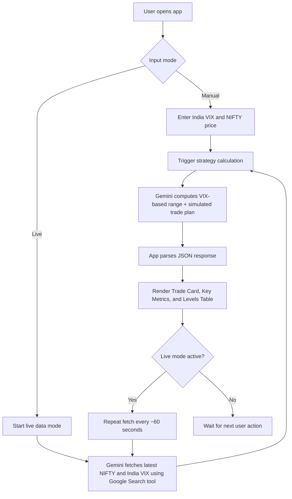
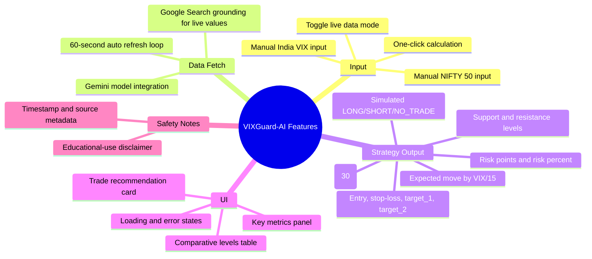

# VIXGuard-AI (Nifty VIX Strategy Calculator)

VIXGuard-AI is a React + TypeScript web app that helps users estimate intraday NIFTY 50 ranges using India VIX and generate a structured trade plan with AI.

## Why this project was made
Indian index traders often calculate probable daily ranges from India VIX manually, then separately think through entries, stop-loss, and targets. This project was made to combine those steps in one simple interface and speed up decision support for intraday planning.

## Who this project helps
- **Beginner and intermediate NIFTY traders** who want a guided, structured way to interpret VIX-based range logic.
- **Active intraday traders** who need quick support/resistance estimates and risk-oriented trade parameters.
- **Learners and builders** exploring how Gemini can be used in a practical finance-focused frontend app.

## What problem this project solves
### Problem
VIX-based range calculations and trade setup generation are usually fragmented across spreadsheets, calculators, and manual notes. That slows analysis and increases inconsistency.

### Solution summary
This app accepts either:
1. Manual India VIX + NIFTY inputs, or
2. Live market fetch mode (via Gemini + Google Search tool),

then returns a structured strategy result containing:
- Expected move (two methods)
- Support and resistance levels
- Simulated trade recommendation (LONG / SHORT / NO_TRADE)
- Entry, stop-loss, targets, and risk metrics

> ⚠️ Educational tool only. Not financial advice.

## Project flow diagram


## Feature diagram


## Key features
- Manual and live input modes
- Two expected-move methods (VIX/15 and VIX/√30)
- Structured strategy output with risk fields
- Live auto-refresh data loop (every 60s)
- Clean dashboard-style UI with loading and error feedback

## Tech stack
- **Frontend:** React 19, TypeScript, Vite
- **Styling:** Tailwind CSS (CDN)
- **AI/Market fetch:** `@google/genai` (Gemini)

## Repository structure
- `App.tsx` - main app flow and state handling
- `services/geminiService.ts` - strategy generation + live market fetch
- `services/marketDataService.ts` - live polling loop
- `components/*` - UI components for form, metrics, levels, and recommendation
- `types.ts` - shared strategy result types

## Setup
### Prerequisites
- Node.js 18+
- npm
- Gemini API key

### Installation
```bash
npm install
```

### Configure environment
Create a `.env.local` file in the project root:
```env
GEMINI_API_KEY=your_api_key_here
```

## Usage
### Run locally
```bash
npm run dev
```
Then open `http://localhost:3000`.

### Build production bundle
```bash
npm run build
```

## Current limitations
- Trade recommendation is explicitly simulated by prompt logic.
- Live values depend on external model responses and can fail or vary.
- No backend persistence (session-only frontend experience).

## Future improvements
- Add deterministic local calculation fallback independent of model output
- Add backtesting/signal validation module
- Add test coverage for service parsing and UI flows
- Add export/share of generated strategy snapshots

## Contributing
Contributions are welcome. Please open an issue first to discuss significant changes.

## License
No license file is currently defined in this repository. Add a `LICENSE` file to clarify usage rights.
